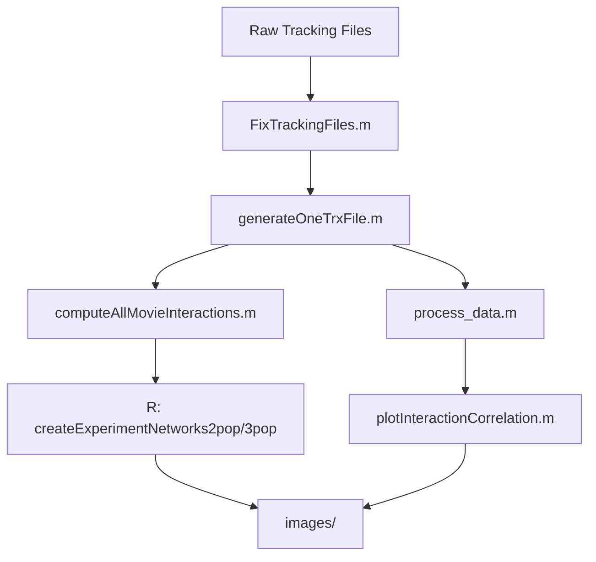

# TADB
Tracking and Analysis of Drosophila's Behavior
# 🪰 Master Thesis Project – Drosophila Behavioral Analysis Pipeline

This repository contains the full pipeline developed during my M.Sc. research, focused on analyzing the behavior of *Drosophila melanogaster* (fruit flies) using video tracking data and custom computational tools.

---

## 🎯 What I Did

- Developed a complete analysis pipeline in **MATLAB** and **R** for behavioral quantification
- Processed raw tracking data to compute per-frame statistics and behavioral summaries
- Designed scripts to identify and quantify **interactions** between flies (pairwise & multi-fly)
- Built **network visualizations** of social behavior across arenas and conditions
- Automated experimental data cleaning, formatting, and ROI mapping
- Produced figures and summary statistics used for academic analysis and presentation

---

## 🧠 Pipeline Architecture

---

## 📁 Project Structure

| Folder | Description |
|--------|-------------|
| `experiments/` | Tracking files and metadata per experiment |
| `arenas/` | Arena definitions and ROI maps |
| `images/` | Exported figures and plots |
| `scatter_plot/` | Visualization of interaction metrics |
| `settings/` | Configuration files for running tools |
| `stat_ext_data/` | Statistical results and processed data |
| `temp/` | Temporary working files used by scripts |

---

## 🔧 Key Scripts Overview

| Script | Purpose |
|--------|---------|
| `FixTrackingFiles.m` | Cleans and corrects corrupted or incomplete tracking data |
| `generateOneTrxFile.m` | Merges multiple `.trx` files into a single trajectory file |
| `computeAllMovieInteractions.m` | Computes social interaction metrics for all flies in all experiments |
| `computeTwoFliesInteractions.m` | Computes pairwise interaction stats |
| `process_data.m` | Extracts behavioral features and aggregates data |
| `plotInteractionCorrelation.m` | Plots correlation between interaction features |
| `RunAllTools.m` | Master script that chains the entire pipeline |
| `createExperimentNetworks2pop.R / 3pop.R` | Builds network graphs based on interaction data |

---

## 📊 Technologies

- MATLAB (behavioral analysis and data processing)
- R (network analysis and visualization)
- Custom CSV file structure for configuration
- Tracking data from Bonsai or similar systems

---

## 👩‍🔬 Author

**Lital Barak**  
M.Sc. in Bioinformatics / Behavioral Biology  
[GitHub Profile](https://github.com/LitalBarak96)

> For questions, academic references or collaborations – feel free to reach out!
